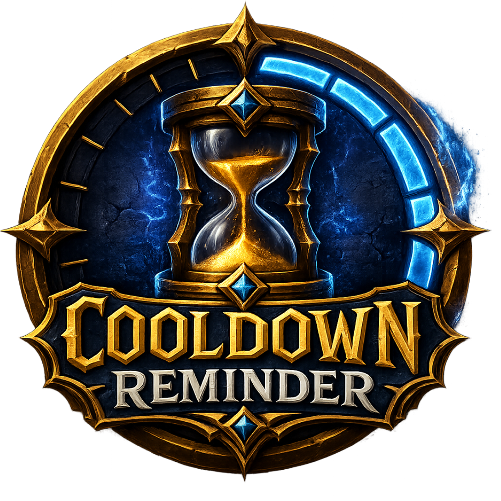
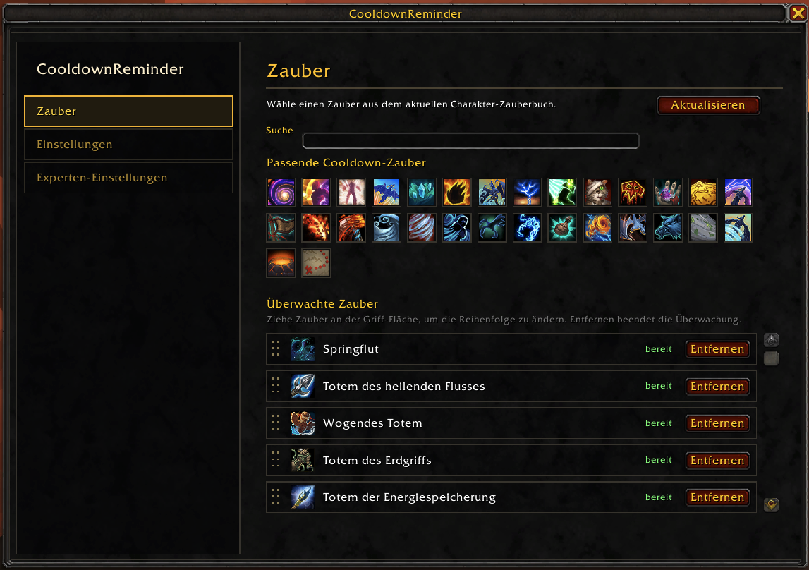
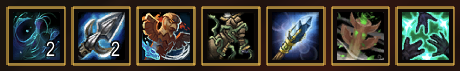
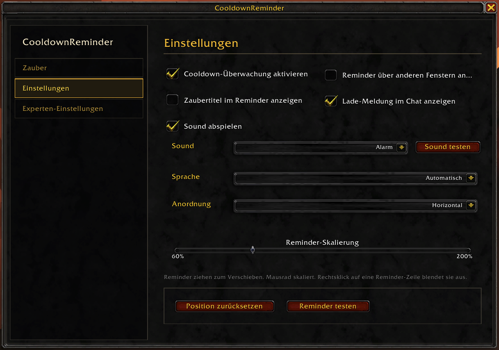
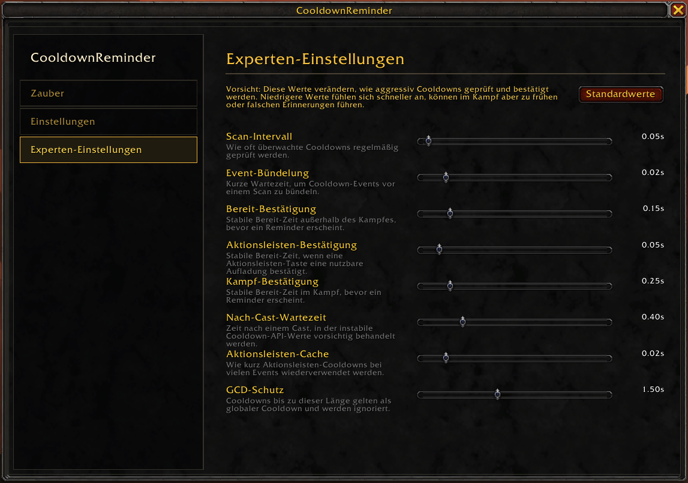

<p align="center">
  
</p>

<h1 align="center">CooldownReminder</h1>

<p align="center">
  A compact World of Warcraft addon that reminds you when selected character spells are ready again.
</p>

<p align="center">
  
  
  
</p>

## UI Preview



## UI Preview Spell Bar



## UI Settings Preview




## What It Does

CooldownReminder watches the cooldowns you care about and shows a minimal movable reminder when a spell is ready. The reminder can show only the spell icon, or the icon plus spell name, and can be arranged vertically or horizontally.

The addon is built for character-specific cooldown tracking: it reads your current spellbook, talents, and action bars, then only offers learned spells that actually have a meaningful cooldown or charges.

- CurseForce Link: [Cooldown Reminder](https://www.curseforge.com/wow/addons/cooldown-reminder)

## Features

- Learned spell detection for the current character and specialization.
- Icon-based spell picker with native in-game spell tooltips.
- Search filtering when the spell grid gets busy.
- Ready reminders shown immediately after adding a ready spell.
- Persistent watched-spell ordering by drag and drop.
- Vertical or horizontal reminder layouts.
- Move and scale the reminder stack directly on screen.
- Optional spell titles, sounds, load message, and top-most behavior.
- Monitoring can be enabled or disabled from settings or slash commands.
- Localized UI for `enUS`, `ptBR`, `esES`, `esMX`, `frFR`, `deDE`, `itIT`, `ruRU`, `zhCN`, `koKR`, and `zhTW`.

## Slash Commands

```text
/cdr          Open settings
/cdr test     Show a test reminder
/cdr reset    Reset reminder position
/cdr toggle   Toggle cooldown monitoring
/cdr ac       Enable cooldown monitoring
/cdr ia       Disable cooldown monitoring
```

## Installation

### Installation with Addon Client

1. Search for "Cooldown Reminder" in your Client and be sure, that Curse Endpoint is enabled (WoWUp for example).

### Manual installation

1. Download the latest release ZIP.
2. Extract it into your World of Warcraft Retail addon folder:

```text
World of Warcraft/_retail_/Interface/AddOns/CooldownReminder
```

3. Restart the game or run `/reload`.
4. Open the addon with `/cdr`.
