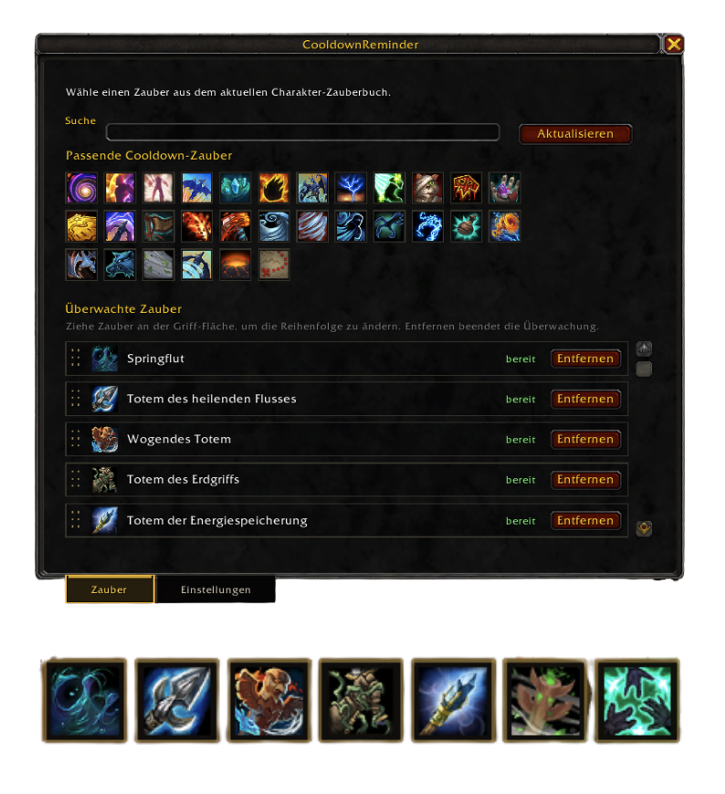

<p align="center">
  
</p>

<h1 align="center">CooldownReminder</h1>

<p align="center">
  A compact World of Warcraft addon that reminds you when selected character spells are ready again.
</p>

<p align="center">
  
  
  
</p>



## What It Does

CooldownReminder watches the cooldowns you care about and shows a minimal movable reminder when a spell is ready. The reminder can show only the spell icon, or the icon plus spell name, and can be arranged vertically or horizontally.

The addon is built for character-specific cooldown tracking: it reads your current spellbook, talents, and action bars, then only offers learned spells that actually have a meaningful cooldown or charges.

## Features

- Learned spell detection for the current character and specialization.
- Icon-based spell picker with native in-game spell tooltips.
- Search filtering when the spell grid gets busy.
- Ready reminders shown immediately after adding a ready spell.
- Persistent watched-spell ordering by drag and drop.
- Vertical or horizontal reminder layouts.
- Move and scale the reminder stack directly on screen.
- Optional spell titles, sounds, load message, and top-most behavior.
- Monitoring can be enabled or disabled from settings or slash commands.
- Localized UI for `enUS`, `deDE`, `frFR`, `esES`, `esMX`, `ruRU`, `zhCN`, and `zhTW`.

## Slash Commands

```text
/cdr          Open settings
/cdr test     Show a test reminder
/cdr reset    Reset reminder position
/cdr ac       Enable cooldown monitoring
/cdr ia       Disable cooldown monitoring
```

## Installation

### Installation with Addon Client

1. Search for "Cooldown Reminder" in your Client and be sure, that Curse Endpoint is enabled (WoWUp for example).

### Manual installation

1. Download the latest release ZIP.
2. Extract it into your World of Warcraft Retail addon folder:

```text
World of Warcraft/_retail_/Interface/AddOns/CooldownReminder
```

3. Restart the game or run `/reload`.
4. Open the addon with `/cdr`.

## CurseForge Release Setup

The GitHub workflow in `.github/workflows/release.yml` creates a ZIP package on every push to `main`, publishes a GitHub release, and can upload the ZIP to CurseForge when these repository secrets are configured:

- `CURSEFORGE_API_TOKEN`
- `CURSEFORGE_PROJECT_ID`

The workflow resolves CurseForge game version IDs automatically. It reads the WoW interface version from `CooldownReminder.toc`, for example:

```text
## Interface: 120007
```

Then it converts that value to the matching Retail version, for example `120007` -> `12.0.7`, calls the CurseForge API, filters for Retail (`wow_retail`, type ID `517`), and sends the resolved numeric IDs to the upload endpoint.

If CurseForge has not listed the newest WoW version yet, the release job fails with a clear message after publishing the GitHub release.

## Development

Run a Lua syntax check before packaging:

```bash
luac -p Core.lua Spells.lua Reminder.lua Options.lua Events.lua Localization/*.lua
```

The addon is split by responsibility:

- `Core.lua` keeps constants, defaults, helpers, database migration, and locale selection.
- `Spells.lua` scans spells and resolves cooldown/charge state.
- `Reminder.lua` owns the reminder stack.
- `Options.lua` builds the configuration UI.
- `Events.lua` wires game events and slash commands.
- `Localization/*.lua` contains translated UI strings.
